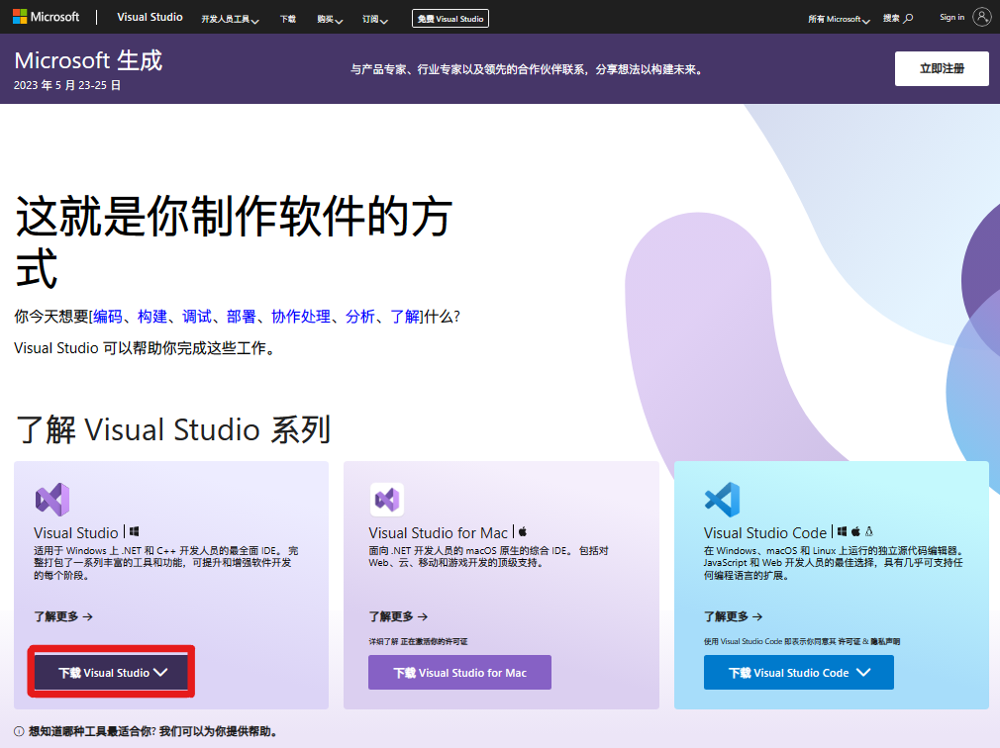

# C++教程 —— 第一课

#### C++的概念与IDE 的安装

> 发布于Github，参考书本：CCF中学生计算机程序设计 - 入门篇。

**C++是什么？**

- C++，是计算机编程语言的一种。除此以外，还有许多编程语言，例如：BASIC语言，C语言，Java语言，Python语言，Rust语言等等。

- 每种计算机编程语言都有自身的语法和规则，即使是同一种语言也有不同版本。例如C++就有Dev-C++和Visual C++等。

**什么是IDE？**

- IDE，即“Integrated Developement Environment"，集成开发环境。

**IDE有什么作用？**

- 首先，我们要知道，一段代码在计算机看来，和普通的文本文档没有区别。我们要通过一个过程，将这段代码转化为计算机能执行的文件。这个过程叫做”**编译**“。

- 为了方便代码的编译和调试，软件公司开发了将许多开发者功能集成到一起的”**集成开发环境**“，即IDE。

**我该用哪个IDE？**

- 不同的IDE有各自的优点，常用的IDE有Dev-C++，Visual Studio，Visual Studio Code等。其中，Dev-C++和Visual Studio Code适用于小型项目，较为轻量，软件大小在1GB以内。而Visual Studio则较为专业，适用于所有规模的项目，基本软件大小大于10GB，完整安装则会占用35GB左右的磁盘空间。
- 功能上，Dev-C++的优点是**小巧**，缺点则是**调试功能不稳定，有时会导致闪退**。Dev-C++也没有”代码补全“和”实时纠错“等功能。而Visual Studio优点就很多了：”代码补全“功能可以提升写代码的速度，”实时纠错“可以**实时显示代码中的语法错误，帮助调试。**其**调试功能也较为完善**。但缺点就是其**体积过于庞大**，对磁盘空间小的用户来说，这无疑是一场灾难。
- 对于C++初学者来说，我更加推荐Visual Studio。若磁盘空间小，可使用Dev-C++代替。

**Visual Studio IDE的安装方法**

- 打开浏览器，访问Visual Studio官方网站https://visualstudio.microsoft.com/（如下图）

  

选择“下载Visual Studio”

其中Community（社区）版本是免费的，其功能对于初学者来说已经足够。

打开刚刚下载的VisualStudioSetup.exe，等待Visual Studio Installer准备完毕。

进入以下界面，勾选红框的工作负荷。

如有需要，可自行修改安装位置。软件较大，安装时间可能较长，耐心等待。

安装完成。